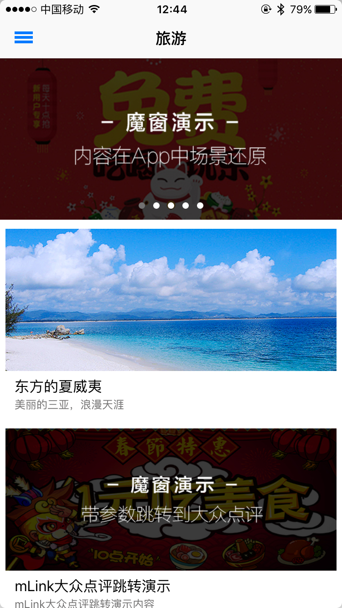
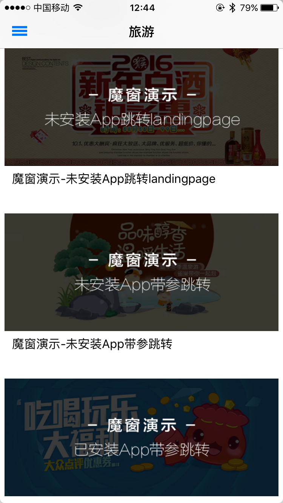
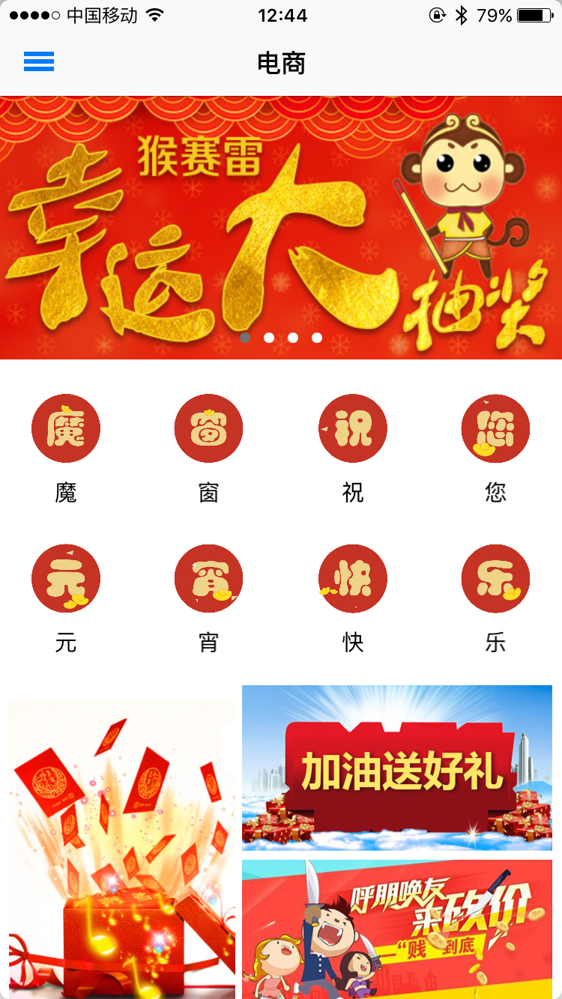
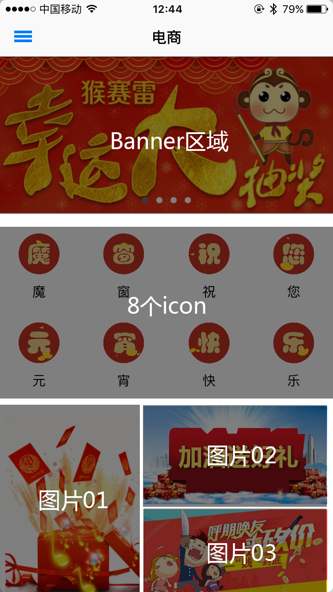
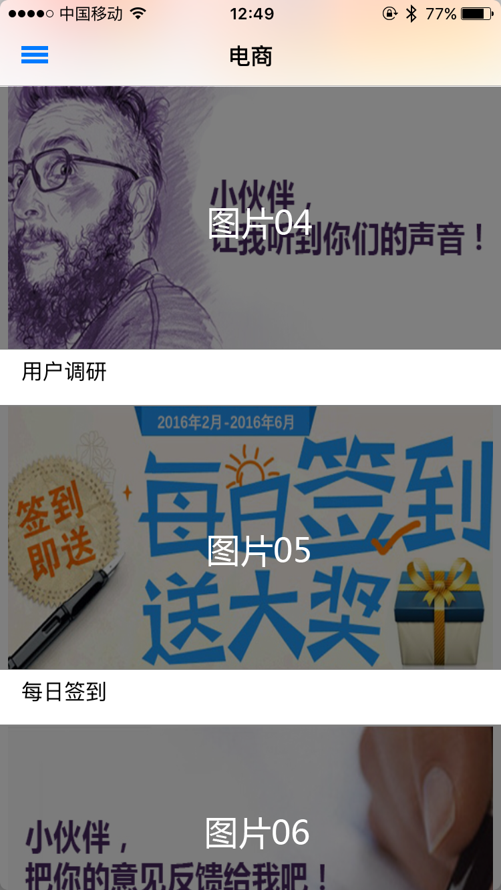

#Demo App使用说明
魔窗——App Growth Engine，通过对Deep Link协议的深度改造以及上层应用层建设，为App提供变革式的面向服务的开发方式，真正打破App孤岛格局，提供极致用户体验，大幅度提升App全生命周期中的转化率，让每一个App都可以轻松情景式相连；与此同时，魔窗提供了专属联合活动以及自运营活动，助力App拉新、促活和留存。 

感谢您体验魔窗Demo App，本Demo主要演示两块内容：mLink以及运营活动。 
在进入App的首页（旅游页），为mLink演示，演示内容如下： 

 
第一个banner：应用内容场景还原。应用内的内容，分享到微信中后，在微信中打开会有一个按钮，点击按钮后，会自动在App中还原微信中打开页面的场景。Banner下图片01：应用间带参数的跳转。点击进入图片01，点击去大众点评看看，会打开大众点评三亚城市的美食分类页面。 
Banner下图片02：H5中的内容带参数的跳转。H5中的三个button点击以后，可以分别跳转到上海肯德基列表页、北京星巴克列表页、具体一家星巴克店的店铺详情页。 
Banner下图片03：未安装App跳转到landing page。点击图片后，若未安装跳转的App，会打开landing page。 
Banner下图片04：未安装App带参跳转。点击图片后，会跳转到另一个landing page，点击下载跳转的App，打开后会打开跳转App的商品页，显示三个酒名。 
Banner下图片05：安装App带参跳转。点击图片后，打开跳转的App中的商品页。显示另外三个酒名。 
电商页面为魔窗活动的演示页面，演示内容如下： 

 
Banner01：联合抽奖活动。用户可以参加由多家App联合发起的抽奖活动，在这个活动中，用户可能抽取到任意一家App的奖品。 
Banner02：许愿树。用户可以摇一摇选择自己想要的奖品，选取后分享到微信中让好友助力，好友助力后达到奖品规定的助力数后，就可以去App中兑换奖品。 
Banner03：e地推。这是一个类似团购的活动，团长可以发起拼团，当达到一定的拼团人数后，团内所有人可以以一个较低的价格获得商品，这个商品可以是需要支付的，也可以是免费的。 
Banner04：超级大转盘。这是一个比较常见的大转盘活动，适用于各种场景，支持不同的用户组抽中不同的奖品。 
中间区域8个icon：支持用户在节假日的时候，根据自己的需求，替换成不同的icon图片，比如元宵来临，我们将上面的文字换成了“魔窗祝您元宵快乐” 

 
图片01：分享送优惠券。用户进入活动时会随机获得一定的优惠券，分享到微信后，好友也可以在微信中领取优惠券。 
图片02：加油赢好礼。用户参与活动后分享到微信中让好友帮忙加油，达到一定的加油数以后，可以获得奖品。 
图片03：砍价。用户参与后可以将页面分享给微信好友，好友点击砍价后可以随机砍掉一定价格，用户可以以砍价后的价格来购买商品。 
图片04：用户调研。调研表单，用户填写调研表单后，可以在后台查看填写的结果。  
图片05：每日签到。用户每日签到后可以获得一定的积分或者优惠券，每日签到事件独立。 
图片06：意见反馈。用户可以填写对App的意见反馈。 
图片07：邀请码。用户将邀请码分享给好友后，其他好友输入邀请码后，用户和好友都能获得积分或优惠券。
