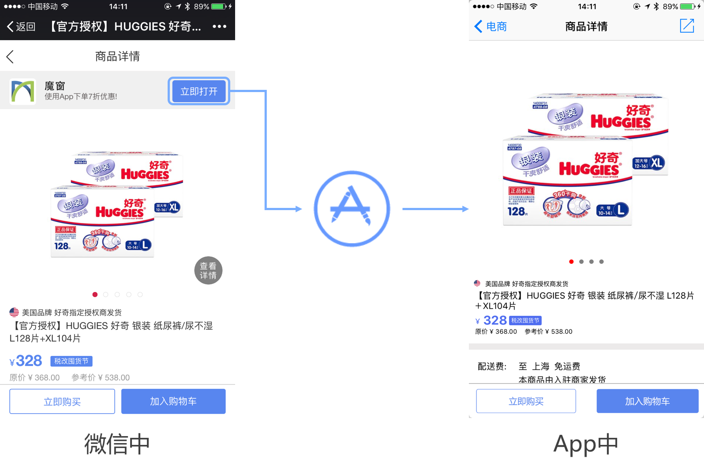
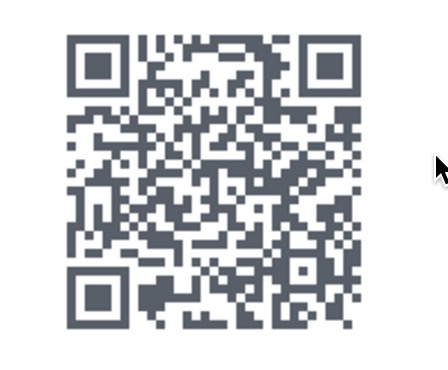
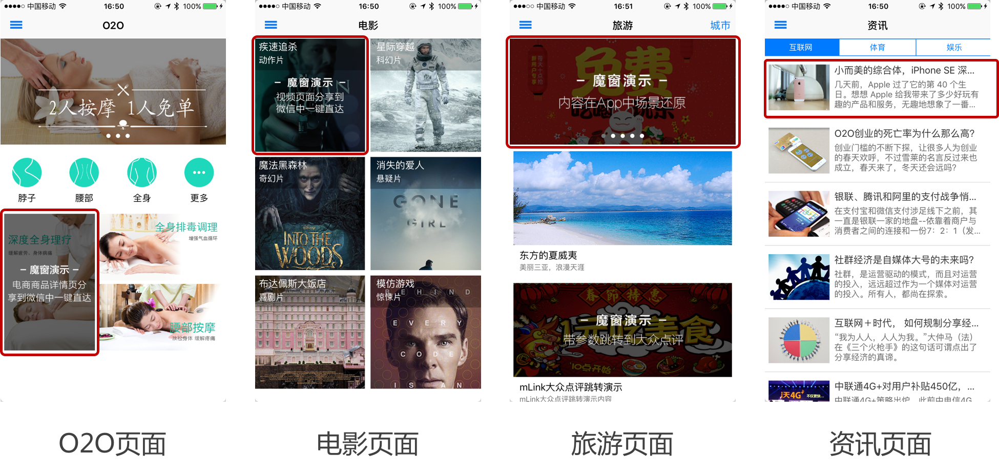
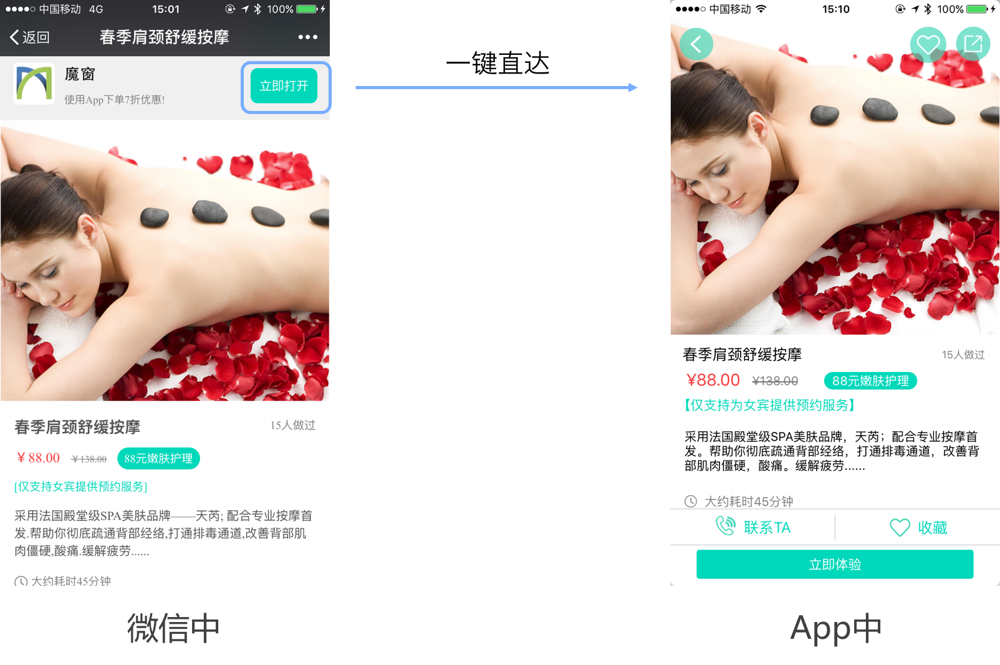
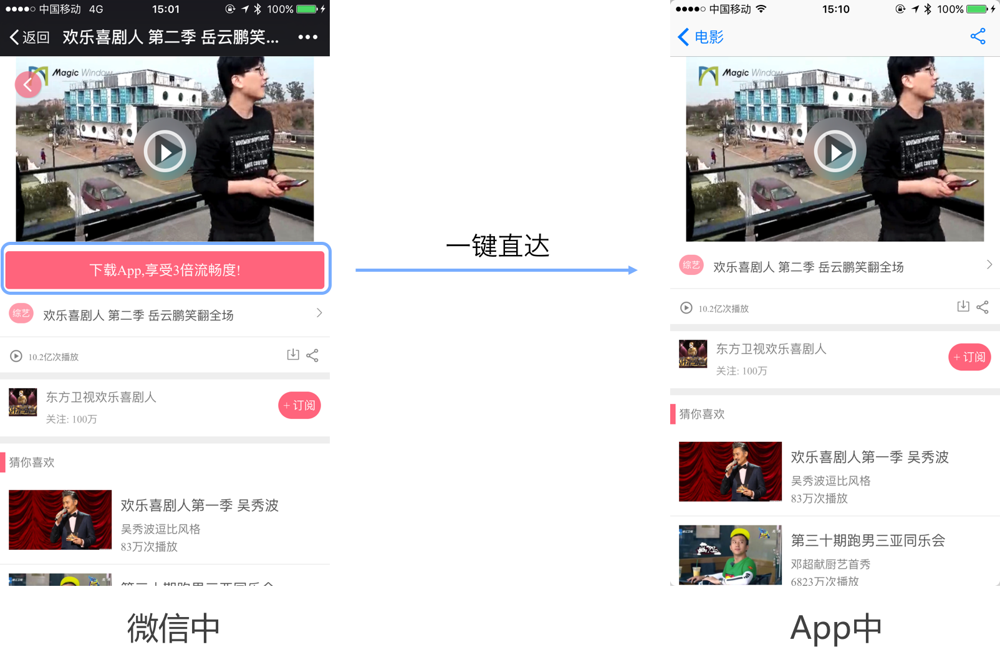
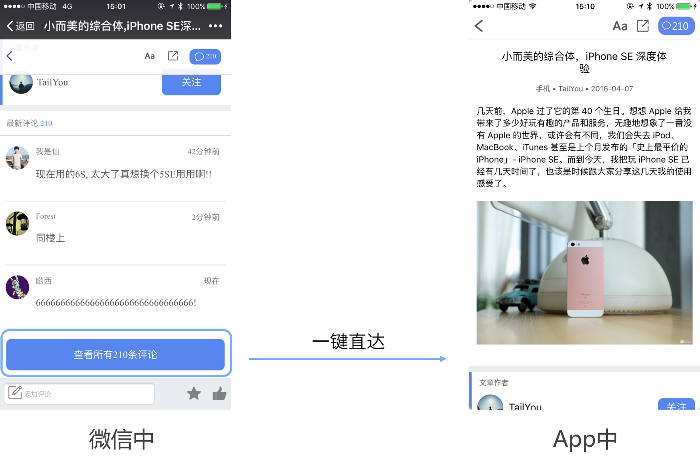
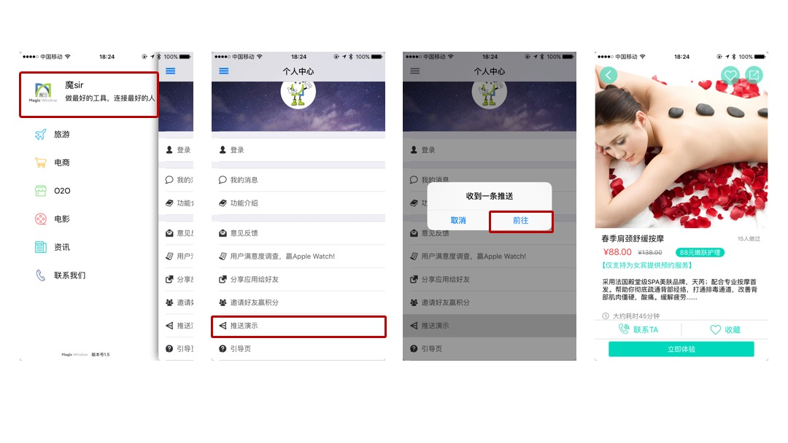
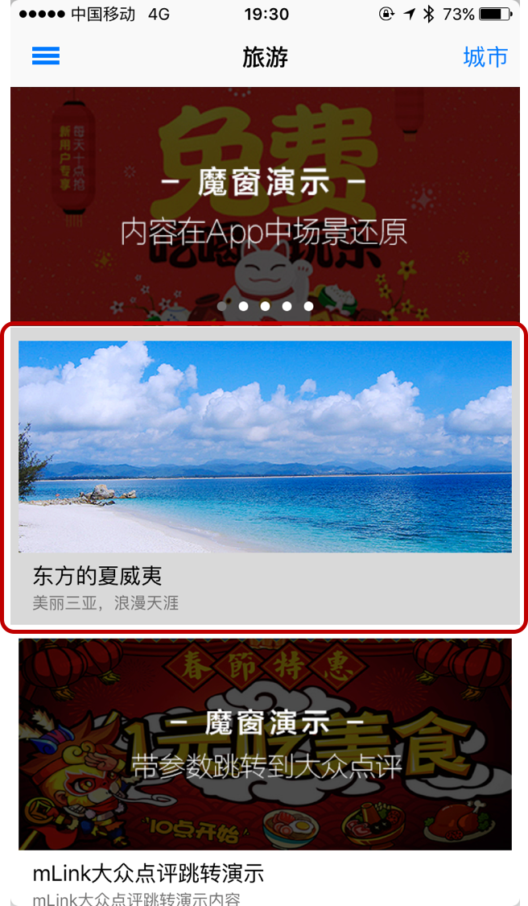
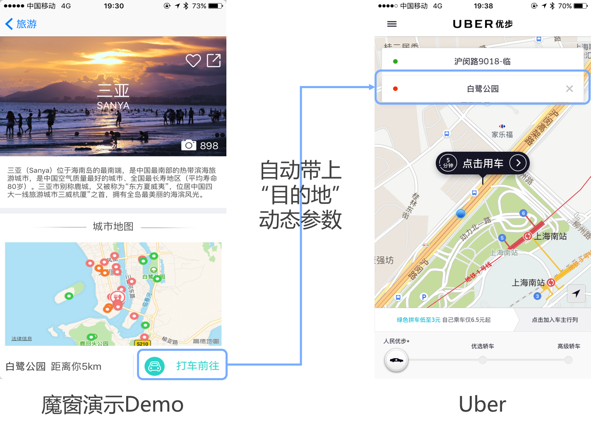
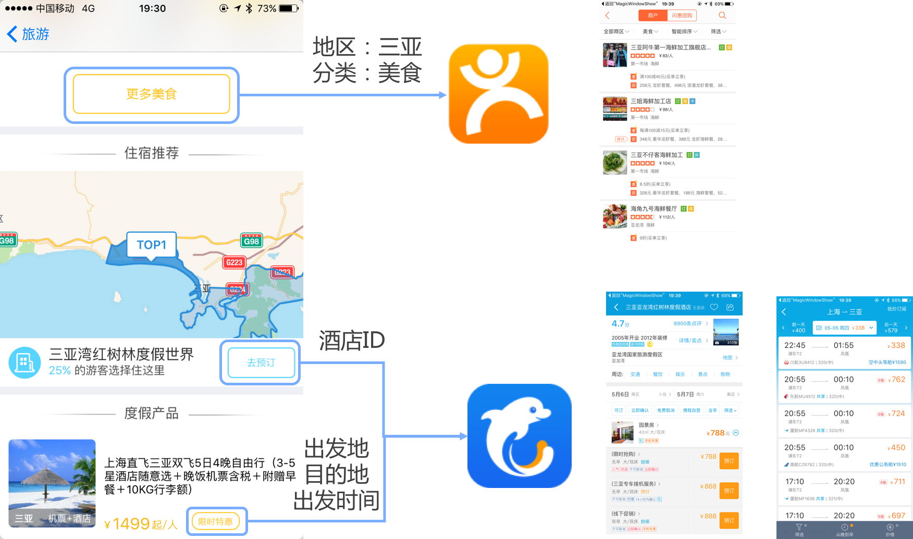

#Demo App使用说明

本App为[魔窗](http://www.magicwindow.cn)演示demo，您可以在App中体验魔窗mLink功能。
#一、	功能简述
mLink，通过URL Scheme和URI，将App中具体的内容页面作为一个服务（比如滴滴的打车服务），以链接的形式分享出来，通过这个链接，可以从外部唤起App并自动进入App中的指定服务页。 
具体表现方式： 
1.可以把服务生成多个短链接，投放到任意渠道（微信、短信、邮件等），用户点击这个短链接：
* 已安装App，唤起App，自动进入指定的服务页。
* 未安装，可以引导用户去下载App，第一次打开自动进入指定服务页，也可以引导用户进入一个http页面进行其他操作。

2.这个服务可以投放到服务市场，被其他App使用，从其他App中点击按钮跳转到自己App的指定服务页。针对已安装和未安装的表现与1中描述一致。

#二、	使用场景：

##1、下载App首次打开场景还原

在微信中浏览商品信息，点击顶部下载浮层中的“立即打开”，下载App，首次打开App自动进入之前微信中浏览的商品信息页。


扫描下方二维码立即体验：


##2、微信中一键唤起App中内容

若您已经完成了第一块内容，您可以体验微信中一键唤起App中的内容页，点击以下三块红框区域可分别进入O2O类、电影类、资讯类的内容页。


将内容分享到微信中，您可以在微信中一键唤起App对应的内容页。

* O2O内容页分享到微信中，在微信中点击“立即打开”，一键唤起App中O2O对应的按摩项目页。


* 电影内容页分享到微信中，在微信中点击“下载App，享受3倍流畅度”，一键唤起App中对应的视频播放页。

* 内容资讯页面分享到微信中，在微信中点击“查看所有210条评论”，一键唤起App中对应的资讯页。

##3、App推送通知一键直达App内容页
右划划出菜单，点击头像，点击“推送演示”，5秒内会受到一条推送通知，点击前往，唤起App内O2O按摩项目页面。

##4、App间端到端的跳转
点击“旅游”菜单下的“东方的夏威夷”，进入三亚旅游介绍页。

在三亚的旅游介绍页，若您已经安装过Uber，点击“打车前往”，将自动跳转到Uber App中，同时，在魔窗演示Demo中的地点信息会自动带到Uber中。

同样的，若您安装过大众点评、携程App，还可以从下方“更多美食”、“去预订”、“限时优惠”点击跳转到大众点评的美食分类页面、携程的酒店详情页以及机票预订页。在这里，也会带上地区、分类、ID、时间等各种动态参数信息。

